<!DOCTYPE html>
<html>
<head>
    <meta charset="utf-8" />
    <meta http-equiv="X-UA-Compatible" content="IE=edge">
    <meta name="viewport" content="width=device-width">
</head>
<body>
    <h1>Bamazon Application</h1>
     
    <h2>Contents</h2>
    <ul>
        <li><a href="#Description" title="Project Descriptions">What Bamazon Does</a></li>
        <li><a href="#Useful" title="Usefulness">Why Bramazon is useful</a></li>
        <li><a href="#Start" title="Get Started">Getting Started with Bamazon</a></li>
        <li><a href="#Help" title="Help">Help with Bamazon</a></li>
        <li><a href="#Maintain" title="Maintenance">Maintenance of Bamazon</a></li>
    </ul>
     
     
     
    

<h2 id="Description">What Bamazon Does</h2>
    
Bamazon is a take off of the Amazon shopping site designed with a command line interface to simulate an aircraft sales store.

    
The program is linked by each node to 2 mySql databases. 

    
The interface uses three different nodes to simulate different users of the site:

     
     
     

<h3>Customer Interface</h3>
    
The Customer interface allows the customer to see the entire inventory and then order the product he/she chooses.
 
    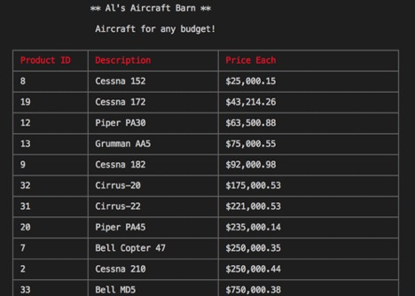
    
The customer can then choose to buy another product

    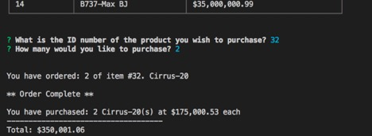
    
When he has ordered all the desired products, The interface shows a summary of all products purchased. 

 
 
 

<h3>Manager Interface</h3>
    
The Manager interface allows the Manager to perform various managment function.
 
    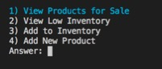
    <h4>View Products</h4>
    
This is an expanded view of the store inventory

    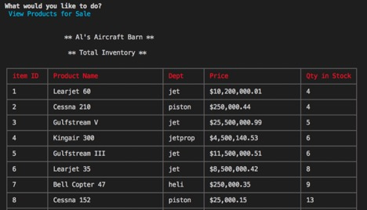
    <h4>View Low Inventory</h4>
    
Shows products with less than 5 in stock

    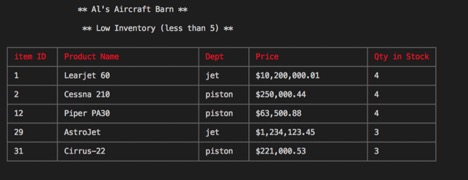
    <h4>Add to Inventory</h4>
    
Allows the Manager to add stock to an existing product

    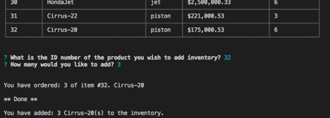
    <h4>Add New Product</h4>
    
Allows the Manager to add a new product to the inventory

    
         
         
          
        <h3>Supervisor Interface</h3>
    
The Supervisor interface allows the Supervisor to perform various high-level functions.
 
    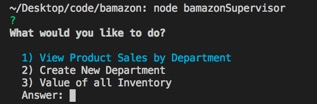
    <h4>View Product Sales by Department</h4>
    
This display links the data of both mySql tables and generates a profit field on the fly.

    
It features a more realistic overhead calculated by a percentage of sales.

    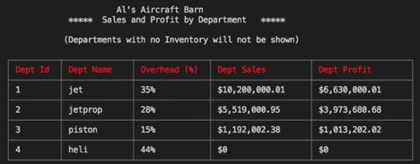
    <h4>Create a new department</h4>
    
Allows (only) a supervisor to create a new product department

    
A manager adding to inventory must enter a valid department based on the supervisor's department database.

    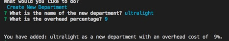
    <h4>Value of All Inventory</h4>
    
This is a value-added display which shows the total value of each product's inventory.

    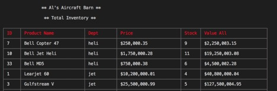
    
It then calculates and displays the total inventory for the entire store.

    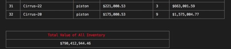 
         
         
         

<h2 id="Useful">Why Bamazon is Useful</h2>

Bamazon is very useful in illustrating the way a node server can connect with a database.

It also helps to illustrate the use of various NPM packages such as:

    <ul>
        <li>"mysql"</li>
        <li>"inquirer"</li>
        <li>"cli-table3</li>
    </ul>

Finally it is a great exercise in learning various mysql query structures.

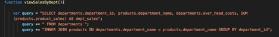
 
 
 

<h2 id="Start">How to Get Started with Bamazon</h2>

Simply open the schema.sql file and generate the databases

Then install the required NPM packages by running NPM install

You should then be able to run your own aviation store!

    
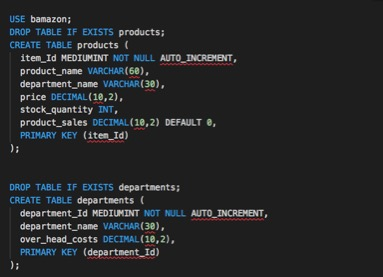
 
 
 

<h2 id="Help">Help with Bamazon</h2>

This is such a simple applicaton that it probably won't require much help.

Stackoverflow as always is a great help in diagnosing questions.

<h2 id="Maintain">Maintaining Bamazon</h2>

As a one time class project this will not likely be revised or maintained.

Thanks for looking through it!

        
            
        

</body>
</html>